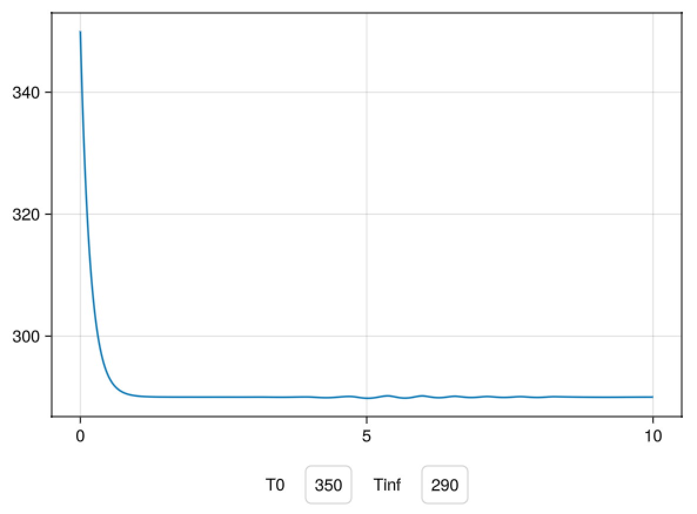

# MakieWebinar
  
This library was created on 23 January 2026 to show how to use Makie, the interactive plotting library for Julia,
with Dyad models to create interactive plots and dashboards.

See the `scripts` folder for the code used in the webinar.
There are multiple files in there, with annotations and comments,
that show how to use Makie to create things with Dyad models.

