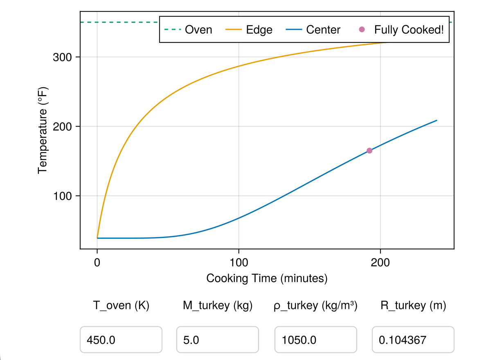

# TurkeyDemo
  
## Interactive Dashboard



To launch an interactive turkey cooking simulation dashboard with adjustable parameters:

1. Install [Dyad](https://help.juliahub.com/dyad/dev/installation.html) if you haven't already.

2. Open this folder in a new VS Code window.
3. Run `Julia: Start REPL` from the VS Code command palette.

4. In the Julia REPL, paste the following code and press `Enter`:
   ```julia
   include("scripts/dashboard.jl")
   ```

This opens a GLMakie window showing temperature over time, with textboxes to adjust oven temperature, turkey mass, density, and radius. The simulation re-runs automatically when you change any parameter (this may take a few seconds).
